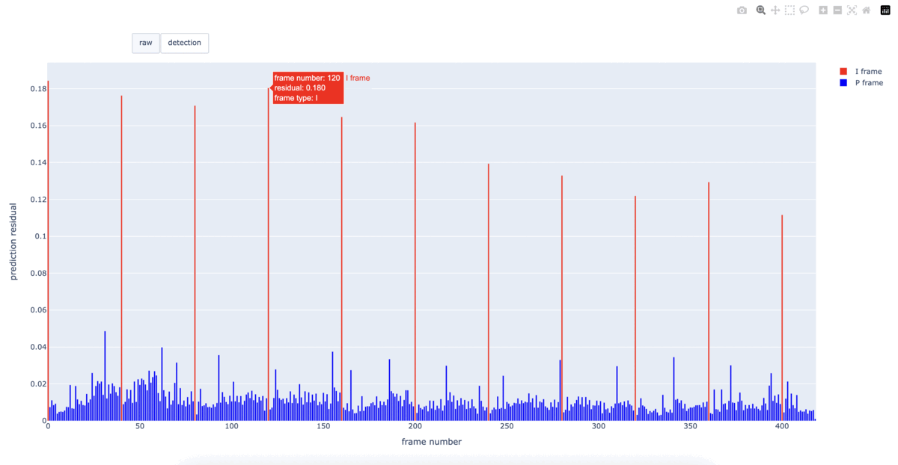

# A Contrario Detection of H.264 Video Double Compression


This is a project detecting whether a video has been recompressed,
and to estimate the fixed size of the primary Group of Pictures (GOP) of 
a recompressd video. 

The project consists of two parts:
* An inspector for H.264 videos that extracts the
intermediate data during the decompression. At present it can
extract the prediction residuals, macroblock types, frame types,
display order and picture coding order. The extractor is based on the
[JM software](https://iphome.hhi.de/suehring/tml/) 
and its [extension](https://vqeg.github.io/software-tools/encoding/modified-avc-codec/).
* An _a Contrario_ detector that detects potential periodic sequence
of residual peaks in P-frames and validate the sequence if the Number
of False Alarms (NFA) is significantly small.


## Before using

1. Install [ffmpeg](https://ffmpeg.org/). You could
use 3rd-party tool to install ffmpeg:

    Ubuntu / Debian:
    ```bash
    sudo add-apt-repository ppa:savoury1/ffmpeg4 -y
    sudo add-apt-repository ppa:savoury1/ffmpeg5 -y
    sudo apt update
    sudo apt install ffmpeg
    ```
   MacOS:
    ```bash
   brew install ffmpeg
    ```
   
    Or install from the official [website](https://ffmpeg.org/download.html).
    
    No matter which installation method is used, make sure ffmpeg can
    be run from bash, e.g.:
    ```bash
    $ ffmpeg -version
   
   ffmpeg version 5.1.2 Copyright (c) 2000-2022 the FFmpeg developers
    built with Apple clang version 14.0.0 (clang-1400.0.29.202)
    configuration: --prefix=/opt/homebrew/Cellar/ffmpeg/5.1.2_1 --enable-shared --enable-pthreads --enable-version3 --cc=clang --host-cflags= --host-ldflags= --enable-ffplay --enable-gnutls --enable-gpl --enable-libaom --enable-libbluray --enable-libdav1d --enable-libmp3lame --enable-libopus --enable-librav1e --enable-librist --enable-librubberband --enable-libsnappy --enable-libsrt --enable-libtesseract --enable-libtheora --enable-libvidstab --enable-libvmaf --enable-libvorbis --enable-libvpx --enable-libwebp --enable-libx264 --enable-libx265 --enable-libxml2 --enable-libxvid --enable-lzma --enable-libfontconfig --enable-libfreetype --enable-frei0r --enable-libass --enable-libopencore-amrnb --enable-libopencore-amrwb --enable-libopenjpeg --enable-libspeex --enable-libsoxr --enable-libzmq --enable-libzimg --disable-libjack --disable-indev=jack --enable-videotoolbox --enable-neon
    libavutil      57. 28.100 / 57. 28.100
    libavcodec     59. 37.100 / 59. 37.100
    libavformat    59. 27.100 / 59. 27.100
    libavdevice    59.  7.100 / 59.  7.100
    libavfilter     8. 44.100 /  8. 44.100
    libswscale      6.  7.100 /  6.  7.100
    libswresample   4.  7.100 /  4.  7.100
    libpostproc    56.  6.100 / 56.  6.100
    ```

2. Clone the project.
   ```bash
   git clone --recurse-submodules https://github.com/li-yanhao/gop_detection
   ```

3. Compile the H.264 decoder (JM software)
   ```bash
   cd jm
   make -j
   ```

4. Install the python requirements for the _a Contrario_ detector.
The code was tested in python 3.8.
   ```bash
   conda create --name myenv python=3.8 # skip this step if use your custom env
   conda activate myenv
   
   pip install -r requirements.txt
   ```

Done! Now all the prerequisites are installed.

## Usage
The input video file must be encoded in H.264. It can be a
`.mp4`, `.avi`, `.mkv`, `.mov`, `.qt`, `.264`
or `.h264` file.
```bash
python test_one_video.py -i <input_video_filename> 
```
For example:
```bash
$ python test_one_video.py -i translate_c2.mp4

Testing translate_c2.mp4 ...
Decoding finished successfully.

Detected candidates are:
periodicity=31 offset=0 NFA=6.495060661229895e-08
periodicity=62 offset=0 NFA=0.10697923484262506
periodicity=62 offset=31 NFA=0.015282747834660722

Estimated primary GOP = 31
NFA = 6.495060661229895e-08
```



Basically this will first extract the intermediate data of
decoding in a temporary folder `gop_dectection/tmp/`, and
detects double compression using these data. The intermediate
data can take up to 1~2 GB depending on the resolution and
the length of the video. You can safely delete `tmp` after
running, or the program will automatically clear the folder
before each execution.


## TODO list

[ ] Refactor the code
   [ ] Rewrite the peak detection with convolution

[ ] Add laplace filter before detection

